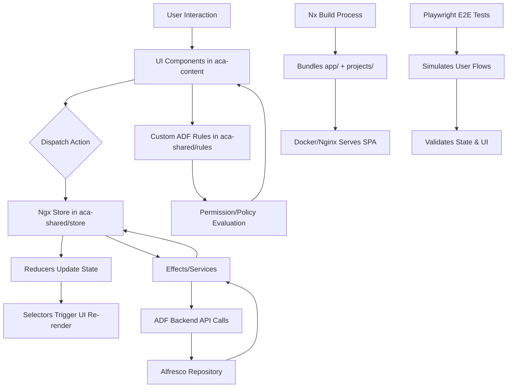

# Alfresco Content Application (ACA) Architecture Overview

## 1. Component Breakdown
The ACA workspace follows a **monorepo architecture** managed by **Nx Workspace**, explicitly separating the main application entry point from reusable, independently versioned library packages. The architecture is divided into six primary architectural components:

| Component | Responsibility | Key Submodules |
|-----------|----------------|----------------|
| **Core Application (`app/`)** | Acts as the Angular bootloader, routing orchestrator, and environment configuration hub. Wires together library packages and handles application lifecycle. | `src/app/` (Root modules, routing, bootstrap), `src/environments/`, `src/assets/` |
| **Shared Infrastructure (`projects/aca-shared/`)** | Provides cross-cutting concerns, global state management, and framework utilities. Ensures consistency across feature modules. | `store/` (NgRx actions, selectors, reducers, states), `rules/` (Custom ADF rule evaluators), global services & utilities |
| **Feature Modules (`projects/aca-content/`)** | Domain-specific content management capabilities. Encapsulates UI components, business logic, and third-party integrations. | `ms-office/` (AOS integration), `viewer/` (Media/PDF services), `folder-rules/` (Actions & properties), `src/` (UI components: search, nav, file lists, context menus) |
| **Testing & QA (`e2e/` & `projects/aca-playwright-shared/`)** | End-to-end validation and shared test utilities. Ensures reliability across feature updates and regression cycles. | `playwright/` (Feature-grouped test specs), `aca-playwright-shared/` (Page objects, helper functions) |
| **DevOps & Tooling (`docker/`, `scripts/`)** | Containerization, CI/CD automation, build pipelines, and release management. | Docker configs, entrypoint scripts, Nginx routing, changelog generator, build/CI helpers |
| **Documentation (`docs/`)** | Centralized knowledge base for developers, users, and localization teams. | Feature guides, setup instructions, changelogs, localized versions |

## 2. Data Flow
The application follows a unidirectional data flow pattern typical of modern Angular/Nx architectures, leveraging NgRx for state management and ADF for backend communication.



**Flow Breakdown:**
1. **Interaction & State Dispatch:** Users interact with components in `aca-content`. Actions are dispatched to the centralized NgRx store in `aca-shared/store`.
2. **State Management & Evaluation:** Reducers process actions and update the global state. Selectors subscribe to state changes, triggering reactive UI updates. Simultaneously, custom ADF rules in `aca-shared/rules` evaluate permissions and policies in real-time.
3. **Backend Communication:** NgRx effects or services intercept state changes, translate them into HTTP requests via the Alfresco Development Framework (ADF), and communicate with the Alfresco Content Repository.
4. **Build & Deployment:** Nx orchestrates the build process, compiling `app/` and all `projects/` libraries into a single optimized SPA. The output is containerized via `docker/` and served through Nginx.
5. **Quality Assurance:** Playwright tests in `e2e/` interact with the deployed application, leveraging shared page objects from `aca-playwright-shared/` to validate end-to-end workflows across auth, upload, search, and sharing features.

## 3. Key Technologies & Dependencies
| Category | Technology | Purpose |
|----------|------------|---------|
| **Frontend Framework** | Angular | Component-based UI architecture & compilation |
| **Monorepo Manager** | Nx Workspace | Task orchestration, dependency graph, library management, build caching |
| **State Management** | NgRx | Centralized reactive state (Actions, Reducers, Selectors, Effects) |
| **Alfresco Integration** | ADF (Alfresco Development Framework) | Backend communication, rule evaluation, content services |
| **Testing** | Playwright | Cross-browser E2E testing, page-object modeling |
| **Containerization** | Docker | Consistent runtime environments, entrypoint automation |
| **Web Server** | Nginx | Static SPA serving, reverse proxy routing, CORS handling |
| **Build & CI/CD** | Nx CLI, Custom Scripts | Incremental builds, changelog generation, pipeline automation |
| **Documentation** | Markdown / Static Site Generators | Technical guides, localization, release notes |

## 4. Directory Structure Explanation
The workspace is structured as a production-grade monorepo. Below is a detailed breakdown of each top-level directory and its architectural role.

### 📁 `app/` – Main Application Bootloader
Serves as the Angular application entry point. It does not contain business logic but acts as the wiring layer that imports and configures library packages.
- `src/app/`: Root Angular modules, application routing configuration, and bootstrap components.
- `src/environments/`: Environment-specific configurations (`environment.ts`, `environment.prod.ts`) for API endpoints, feature flags, and build metadata.
- `src/assets/`: Static resources, localization files, extension definitions, and configuration manifests.

### 📁 `projects/` – Nx Monorepo Library Packages
Contains independently versioned, reusable libraries managed by Nx. Each package is designed for loose coupling and high cohesion.
- `aca-shared/`: **Core infrastructure library**. Houses the NgRx store (`store/`), global services, framework utilities, and custom ADF rule evaluators (`rules/`). Acts as the single source of truth for state and policy logic.
- `aca-content/`: **Feature domain library**. Encapsulates content management capabilities:
  - `ms-office/`: Microsoft Office Online Server (AOS) integration for in-browser editing.
  - `viewer/`: Custom media and PDF rendering services.
  - `folder-rules/`: Folder-level actions, property management, and execution rules.
  - `src/`: UI component library (search panels, side-navigation drawers, file lists, context menus).
- `aca-playwright-shared/`: **Testing utility library**. Exports shared Playwright helper functions, locators, and page-object models to reduce duplication across E2E test suites.

### 📁 `e2e/` – End-to-End Test Suite
Dedicated to automated quality assurance using Playwright.
- `playwright/`: Test specifications organized by business capability (`auth.spec.ts`, `upload.spec.ts`, `delete.spec.ts`, `search.spec.ts`, `folder-rules.spec.ts`, `share.spec.ts`, `view.spec.ts`, `pagination.spec.ts`). Ensures regression coverage for critical user journeys.

### 📁 `docker/` – Containerization & Deployment
Provides infrastructure-as-code for consistent local and production environments.
- Dockerfiles, entrypoint scripts, and Nginx routing configurations. Handles static asset serving, reverse proxy setup, and environment variable injection at runtime.

### 📁 `scripts/` – DevOps & Automation
CLI utilities and automation scripts to streamline development and release workflows.
- Changelog generator, build step orchestrators, CI/CD pipeline helpers, and local development environment setup tools.

### 📁 `docs/` – Documentation Hub
Centralized repository for technical and user-facing documentation.
- Feature guides, setup instructions, architecture diagrams, changelogs, and localized documentation versions. Maintains alignment between code changes and user knowledge.

### 🌳 Complete Workspace Tree
```
📦 alfresco-content-application/
├── 📁 docs/                  # Documentation & localization
├── 📁 app/                   # Angular bootloader & routing
│   └── 📁 src/
│       ├── 📁 assets/        # Static files & configs
│       ├── 📁 environments/  # Env-specific configs
│       └── 📁 app/           # Root modules & bootstrap
├── 📁 docker/                # Container & Nginx configs
├── 📁 scripts/               # Build, CI/CD & automation
├── 📁 e2e/                   # Playwright E2E tests
│   └── 📁 playwright/        # Feature-grouped test specs
└── 📁 projects/              # Nx monorepo libraries
    ├── 📁 aca-playwright-shared/ # Shared test utilities
    ├── 📁 aca-shared/          # Core state, services & ADF rules
    │   ├── 📁 store/         # NgRx state management
    │   └── 📁 rules/         # Custom rule evaluators
    └── 📁 aca-content/       # Feature modules & UI components
        ├── 📁 ms-office/     # Office integration
        ├── 📁 viewer/        # Media/PDF services
        ├── 📁 folder-rules/  # Folder actions & properties
        └── 📁 src/           # UI components
```
This architecture emphasizes **separation of concerns**, **reusability**, and **testability**, leveraging Nx’s dependency graph to enforce strict boundaries between the bootloader, shared infrastructure, and feature domains.