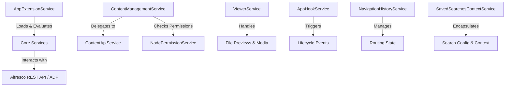

```markdown


# ACA Angular Services Reference

## 📖 Project Description
This document serves as the comprehensive technical reference for the core Angular services powering the **Alfresco Content Application (ACA)**. It details service responsibilities, architectural interactions, configuration patterns, and practical usage examples. Designed for developers extending, integrating, or maintaining ACA-based applications, this guide provides a structured overview of how data flows, permissions are evaluated, and UI components are driven by the underlying service layer.

---

## ✨ Key Features
- 🔌 **Extension-First Architecture**: Centralized plugin, toolbar, sidebar, and context menu management via `AppExtensionService`.
- 🔐 **Granular Permission Evaluation**: Real-time, cached node-level permission checks with `NodePermissionService`.
- 🌐 **Unified API Abstraction**: Clean, standardized wrappers for Alfresco REST endpoints via `ContentApiService`.
- 📂 **Orchestrated Content Operations**: High-level file management, metadata updates, locking, and sharing through `ContentManagementService`.
- 👁️ **Smart Viewer Integration**: Dynamic preview rendering, format detection, and media handling with `ViewerService`.
- 🪝 **Lifecycle & Event Hooks**: Extensible app lifecycle management and middleware-like behavior via `AppHookService`.
- 🧭 **Navigation History Management**: Robust routing history tracking for seamless back/forward navigation and state preservation.
- 🔍 **Saved Search Context**: Centralized state, configuration, and persistence for search executions via `SavedSearchesContextService`.

---

## 🏗️ Architecture Overview
The ACA service layer follows a **modular, dependency-injected architecture** built on Angular's core principles. Services are organized by domain responsibility and communicate through reactive streams (`Observable`/`BehaviorSubject`) and shared state management.



**Key Architectural Patterns:**
- **Dependency Injection**: All services are registered with `providedIn: 'root'` for singleton lifecycle and tree-shakability.
- **Reactive Communication**: Cross-service interactions use RxJS streams to maintain unidirectional data flow and prevent circular dependencies.
- **Decoupled Extensions**: The extension system evaluates rules at runtime, allowing dynamic UI composition without core service modifications.
- **Caching & Optimization**: Permission checks and API responses are cached where applicable to minimize network overhead.

---

## 📦 Installation
To integrate or reference these services in your ACA-based application:

1. **Prerequisites**
   - Node.js `>= 18.x`
   - Angular CLI `>= 17.x`
   - Alfresco Content Services (ACS) or ADF environment

2. **Add Dependencies**
   ```bash
   npm install @alfresco/aca-shared @alfresco/aca-content
   ```

3. **Module Registration**
   Ensure the services are available in your root or feature module:
   ```typescript
   import { ContentManagementService } from '@alfresco/aca-content';
   import { AppExtensionService } from '@alfresco/aca-shared';

   @NgModule({
     providers: [ContentManagementService, AppExtensionService]
   })
   export class AppModule {}
   ```

---

## 🚀 Usage Examples
Below are practical examples demonstrating how to consume key services in your components or other services.

### 🔌 Loading Extensions & Evaluating Rules
```typescript
import { Injectable } from '@angular/core';
import { AppExtensionService } from '@alfresco/aca-shared';

@Injectable({ providedIn: 'root' })
export class ExampleComponent {
  constructor(private extensionService: AppExtensionService) {}

  ngOnInit() {
    const toolbarActions = this.extensionService.getToolbarActions();
    const rules = this.extensionService.evaluateRules('context:node');
  }
}
```

### 📂 Managing Content Operations
```typescript
import { ContentManagementService } from '@alfresco/aca-content';
import { NodeEntry } from '@alfresco/js-api';

@Injectable({ providedIn: 'root' })
export class FileManager {
  constructor(private contentMgmt: ContentManagementService) {}

  async deleteNode(node: NodeEntry) {
    await this.contentMgmt.deleteNode(node.id);
  }

  async toggleFavorite(node: NodeEntry) {
    await this.contentMgmt.toggleFavorite(node.id);
  }
}
```

### 🔐 Checking Node Permissions
```typescript
import { NodePermissionService } from '@alfresco/aca-shared';

@Injectable({ providedIn: 'root' })
export class PermissionChecker {
  constructor(private permissionService: NodePermissionService) {}

  canEdit(nodeId: string): boolean {
    return this.permissionService.hasPermission(nodeId, 'write');
  }
}
```

---

## ⚙️ Configuration
Most services are configured via the application's `app.config.ts` or `environment.ts` files. Below are common configuration patterns:

### 📝 Extension Configuration (`app.config.ts`)
```typescript
export const appConfig: AppConfig = {
  extensions: {
    toolbar: ['create', 'upload', 'share'],
    sidebar: ['favorites', 'trashcan', 'shared'],
    contextMenus: ['download', 'delete', 'properties']
  },
  rules: {
    'node:read': { enabled: true, priority: 1 },
    'node:write': { enabled: true, priority: 2 }
  }
};
```

### 👁️ Viewer Configuration
```typescript
export const viewerConfig: ViewerConfig = {
  supportedFormats: ['pdf', 'docx', 'xlsx', 'png', 'jpg'],
  maxPreviewSize: 50 * 1024 * 1024, // 50MB
  fallbackRenderer: 'default'
};
```

### 🧭 Navigation & Search Context
```typescript
export const navigationConfig: NavigationConfig = {
  historyLimit: 50,
  preserveScrollPosition: true
};

export const searchConfig: SavedSearchConfig = {
  defaultQuery: 'content:*',
  maxResults: 50,
  enableSavedSearches: true
};
```

---

## 📚 Core Services Reference
Detailed breakdown of each service, including file paths, responsibilities, and key interactions.

### 1. `AppExtensionService`
- **Path**: `projects/aca-shared/src/lib/services/app.extension.service.ts`
- **Responsibilities**: 
  - Central entry point for extension configurations.
  - Dynamically loads plugins, toolbar actions, create menu actions, sidebar tabs, navbar links, and context menus.
  - Evaluates rule contexts using ADF extension rules engine.
- **Key Methods**: `getToolbarActions()`, `evaluateRules(context)`, `loadExtensions()`

### 2. `ContentManagementService`
- **Path**: `projects/aca-content/src/lib/services/content-management.service.ts`
- **Responsibilities**: 
  - Orchestrates high-level content and repository operations.
  - Interacts with `NodesApiService` and `ContentApiService` for data fetching.
  - Triggers favorite actions, uploader dialogs, shared link creation, node metadata updates, lock/unlock, deletion, and restoration.
- **Key Methods**: `deleteNode()`, `toggleFavorite()`, `createSharedLink()`, `updateMetadata()`

### 3. `NodePermissionService`
- **Path**: `projects/aca-shared/src/lib/services/node-permission.service.ts`
- **Responsibilities**: 
  - Determines user permissions (read, write, delete, update, share) on a given node/folder.
  - Caches permission results for performance.
  - Integrates with ACL evaluation logic.
- **Key Methods**: `hasPermission(nodeId, permission)`, `getPermissions(nodeId)`

### 4. `ContentApiService`
- **Path**: `projects/aca-shared/src/lib/services/content-api.service.ts`
- **Responsibilities**: 
  - Provides standardized wrapper methods for accessing Alfresco REST APIs.
  - Handles Favorites, Nodes, Sites, and Trashcan endpoints.
  - Manages pagination, error handling, and response transformation.
- **Key Methods**: `getNodes()`, `getFavorites()`, `getSites()`, `getTrashcan()`

### 5. `ViewerService`
- **Path**: `projects/aca-content/viewer/src/lib/services/viewer.service.ts`
- **Responsibilities**: 
  - Manages file previews, format detection, and PDF/media rendering.
  - Handles fallback renderers and streaming for large files.
  - Integrates with external viewer libraries (e.g., PDF.js, Office Online).
- **Key Methods**: `previewFile(nodeId)`, `getSupportedFormats()`, `renderViewer()`

### 6. `AppHookService`
- **Path**: `projects/aca-shared/src/lib/services/app-hook.service.ts`
- **Responsibilities**: 
  - Provides hooks for application actions and lifecycle operations.
  - Emits events for app initialization, route changes, and user interactions.
  - Enables custom middleware-like behavior.
- **Key Methods**: `onInit()`, `onRouteChange()`, `registerHook(name, callback)`

### 7. `NavigationHistoryService`
- **Path**: `projects/aca-shared/src/lib/services/navigation-history.service.ts`
- **Responsibilities**: 
  - Manages routing navigation history within the content app.
  - Tracks visited routes, query parameters, and state.
  - Enables programmatic navigation and history stack manipulation.
- **Key Methods**: `pushHistory()`, `popHistory()`, `getCurrentRoute()`

### 8. `SavedSearchesContextService`
- **Path**: `projects/aca-content/src/lib/services/saved-searches-context.service.ts`
- **Responsibilities**: 
  - Encapsulates context and search configurations for saved search execution.
  - Manages query persistence, filters, and result caching.
  - Syncs search state across components and routes.
- **Key Methods**: `saveSearch(config)`, `loadSavedSearches()`, `executeSearch(query)`

---

## 🤝 Contributing
Contributions are welcome! Please read our [Contributing Guidelines](CONTRIBUTING.md) and submit pull requests for bug fixes, documentation improvements, or new service integrations.

## 📄 License
This project is licensed under the [Apache License 2.0](LICENSE).

---
*Generated for the Alfresco Content Application (ACA) Engineering Team*
```