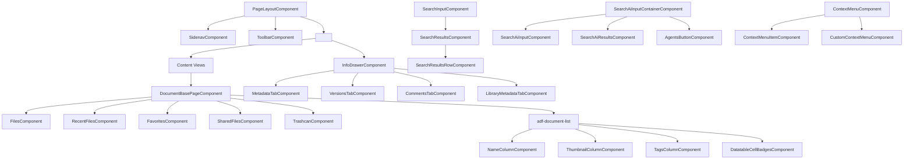
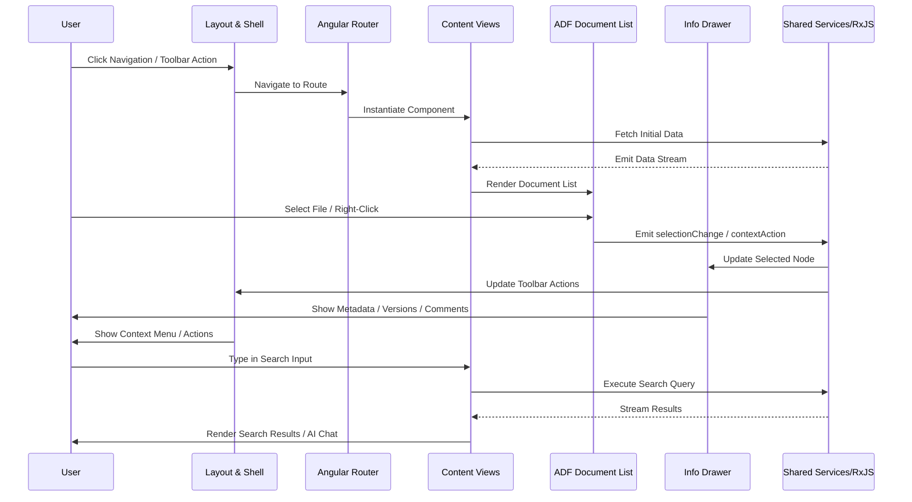

# Architecture Overview: Alfresco Content Application (ACA)

## Component Breakdown

The ACA frontend follows a modular, feature-driven Angular architecture. Components are logically grouped by responsibility, leveraging composition, inheritance, and reactive patterns to maintain scalability and testability.

### 1. Layout & Shell (`aca-shared`)
Responsible for the global application chrome, routing infrastructure, and consistent UI boundaries.
- **`PageLayoutComponent`**: Root container component. Manages the primary viewport, integrates the header, content area (`<router-outlet>`), and error boundaries. Acts as the composition root for all feature views.
- **`SidenavComponent`**: Persistent left navigation panel. Composed of `SidenavHeaderComponent`, `UserMenuComponent`, `ExpandMenuComponent`, and `ButtonMenuComponent`. Handles navigation state and user context.
- **`ToolbarComponent`**: Global top action bar. Contains `ToolbarButtonComponent`, `ToolbarMenuComponent`, `ToolbarMenuItemComponent`, and `ToolbarActionComponent`. Provides context-aware actions that persist across content views.

### 2. Content Views (`aca-content`)
Feature-specific pages rendered inside the `PageLayoutContentComponent` via Angular Router.
- **`DocumentBasePageComponent`**: Abstract/base class providing shared template structure, routing guards, and common data-fetching logic for all document/list views.
- **Concrete Views**: `FilesComponent`, `RecentFilesComponent`, `FavoritesComponent`, `SharedFilesComponent`, `TrashcanComponent`. Extend `DocumentBasePageComponent` and inject view-specific query parameters/filters.
- **`adf-document-list`**: ADF primitive responsible for high-performance rendering of file/folder trees and grids.
- **Custom Column Cells**: Extends ADF's rendering pipeline with domain-specific UI:
  - `NameColumnComponent`: Renders file names with type-specific icons.
  - `ThumbnailColumnComponent`: Handles image previews and fallback icons.
  - `TagsColumnComponent`: Displays and manages file metadata tags.
  - `DatatableCellBadgesComponent`: Generic badge renderer for status/attributes.

### 3. Details & Info Drawer (`aca-shared`)
Provides contextual information and metadata management without disrupting the primary content view.
- **`InfoDrawerComponent`**: Collapsible right sidebar. Implements a tabbed architecture to isolate concerns:
  - `MetadataTabComponent` / `LibraryMetadataTabComponent` & `LibraryMetadataFormComponent`: CRUD operations for document/library properties.
  - `VersionsTabComponent`: Version history listing and rollback actions.
  - `CommentsTabComponent`: Threaded comment UI and submission.
- **`DetailsComponent`**: Full-page alternative for deep-dive file inspection, typically triggered by explicit navigation or modal expansion.

### 4. Search & AI (`aca-content`)
Decoupled search interfaces with clear separation between input, result rendering, and AI orchestration.
- **Standard Search**: `SearchInputComponent` → `SearchResultsComponent` → `SearchResultsRowComponent`. Linear composition with event-driven data propagation.
- **AI Search**: `SearchAiInputContainerComponent` acts as a facade, delegating to `SearchAiInputComponent`, `SearchAiResultsComponent`, and `AgentsButtonComponent`. Designed for streaming responses and agent-driven query expansion.

### 5. Context Menu (`aca-shared`)
- **`ContextMenuComponent`**: Position-agnostic overlay component.
- **`ContextMenuItemComponent`**: Reusable action button for menu entries.
- **`CustomContextMenuComponent`**: Extension point for domain-specific actions (e.g., version rollback, metadata edit, share).

---

## Data Flow

The application utilizes a reactive, unidirectional data flow pattern typical of modern Angular architectures. Communication occurs through three primary mechanisms: **EventEmitters/Outputs**, **RxJS Services/Subjects**, and **Angular Router/State**.

### Core Interaction Patterns
1. **Navigation & Routing**: `SidenavComponent` emits navigation events → Angular Router updates `PageLayoutComponent`'s `<router-outlet>` → Target `DocumentBasePageComponent` subclass initializes.
2. **File Selection & Context Sync**: User clicks a row in `adf-document-list` → Emits `selectionChange` event → `InfoDrawerComponent` and `ToolbarComponent` subscribe to a shared `SelectedNodeService` (RxJS) → UI updates metadata, actions, and badges.
3. **Search Execution**: `SearchInputComponent` captures query → Emits to `SearchService` → Backend API call → `BehaviorSubject` emits results → `SearchResultsComponent` renders → `SearchResultsRowComponent` handles row-level interactions.
4. **AI Search Orchestration**: `SearchAiInputComponent` sends prompt → `SearchAiService` streams response → `SearchAiResultsComponent` updates incrementally → `AgentsButtonComponent` toggles agent context, modifying the request payload.
5. **Context Menu Actions**: Right-click on row → `ContextMenuComponent` positions overlay → `ContextMenuItemComponent` emits action → `ToolbarComponent` or `InfoDrawerComponent` executes business logic → State updates propagate reactively.

### State Management Strategy
- **Local Component State**: Managed via `@Input()`/`@Output()` for tightly coupled parent-child relationships.
- **Shared Application State**: Centralized in injectable services using `BehaviorSubject`/`ReplaySubject` for cross-component synchronization (e.g., selected node, search query, user permissions).
- **Routing State**: Preserved via Angular Router query parameters and route data for deep linking and browser history.

---

## Key Technologies & Dependencies

| Category | Technology | Role in Architecture |
|----------|------------|----------------------|
| **Core Framework** | Angular (v14+) | Component-based UI, dependency injection, routing, reactive forms |
| **Reactive Programming** | RxJS | Stream-based state management, event handling, async operations |
| **Domain UI Library** | ADF (Alfresco Development Framework) | Provides `adf-document-list`, node selectors, and Alfresco API integrations |
| **Language** | TypeScript | Static typing, interfaces, strict architectural boundaries |
| **State/Communication** | Angular Services + RxJS Subjects | Decoupled component communication, shared context, reactive updates |
| **Styling** | SCSS / CSS Variables / Angular CDK | Component encapsulation, theme support, accessible overlays |
| **Testing** | Jasmine/Karma, Angular Testing Library | Unit tests for components/services, integration tests for flows |

---

## Directory Structure Explanation

The provided structure reflects a **feature-sliced architecture** aligned with Angular best practices:

```
src/app/
├── aca-shared/                  # Reusable, framework-agnostic UI primitives
│   ├── layout/                  # PageLayout, Sidenav, Toolbar (global chrome)
│   ├── drawer/                  # InfoDrawer, Tab components (contextual UI)
│   ├── search/                  # Standard & AI search containers
│   └── context-menu/            # Overlay menu system
├── aca-content/                 # Feature-specific business views
│   ├── views/                   # Files, Recent, Favorites, Shared, Trashcan
│   ├── base/                    # DocumentBasePageComponent (abstract template)
│   ├── columns/                 # Custom ADF cell renderers
│   └── details/                 # DetailsComponent & metadata forms
└── core/                        # (Implied) Services, interceptors, guards, models
```

### Architectural Conventions
- **`aca-shared` vs `aca-content`**: Clear separation between **presentation infrastructure** (layout, global UI, drawers) and **domain features** (file views, business logic). Shared components are framework-agnostic and reusable across modules.
- **Base Class Pattern**: `DocumentBasePageComponent` enforces consistent routing, loading states, and error handling across all content views, reducing duplication.
- **Custom Cell Extension**: ADF's `adf-document-list` is extended via custom column components rather than forking the library, preserving upgradeability while enabling domain-specific rendering.
- **Tabbed Information Architecture**: `InfoDrawerComponent` uses a tab-based composition to isolate metadata, versions, and comments, enabling lazy loading and independent state management per tab.
- **Container/Presentational Split**: AI search and standard search follow a container pattern where parent components manage state/API calls, and child components remain pure and focused on rendering.

---

## Architectural Diagrams

### Component Hierarchy & Composition


### Data Flow & Communication
